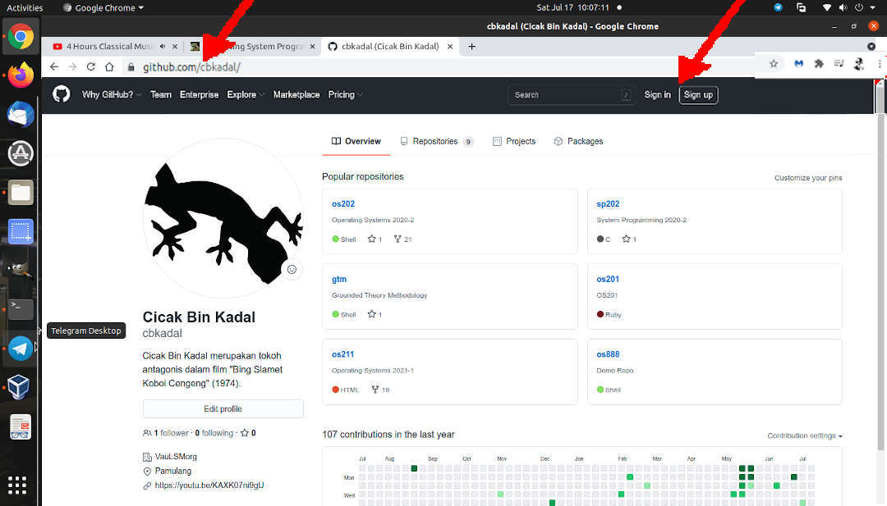
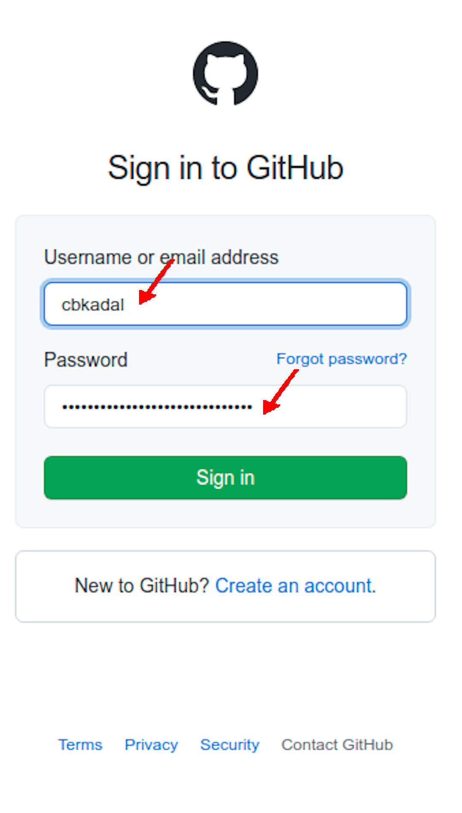
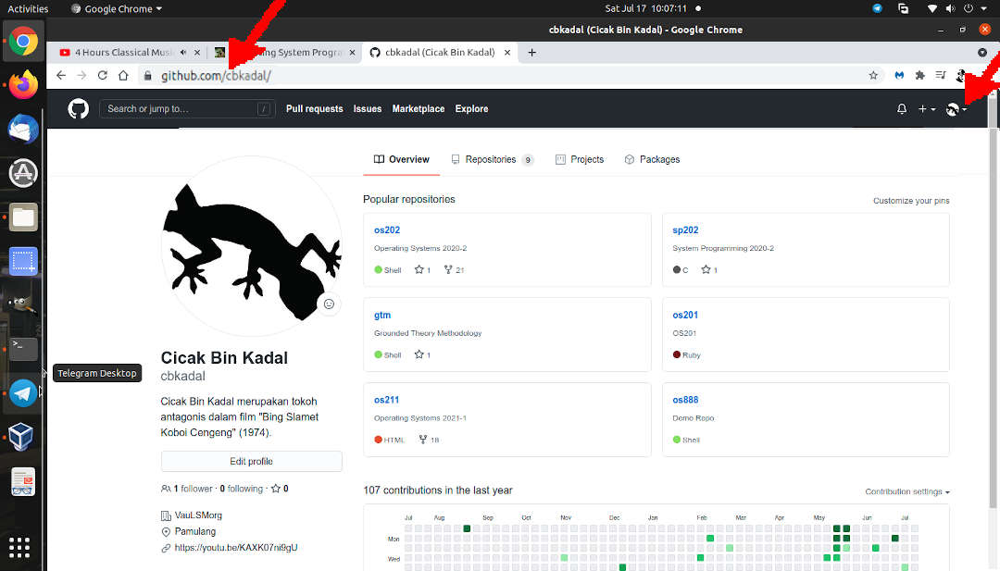
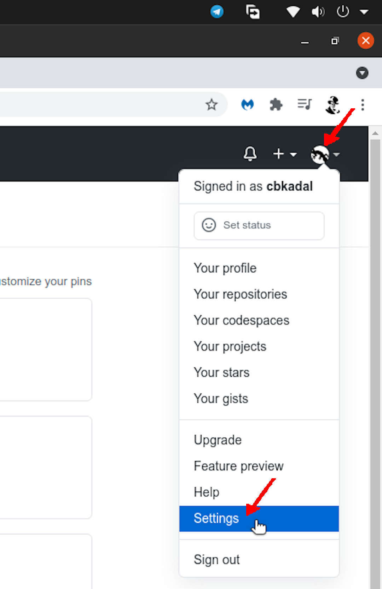
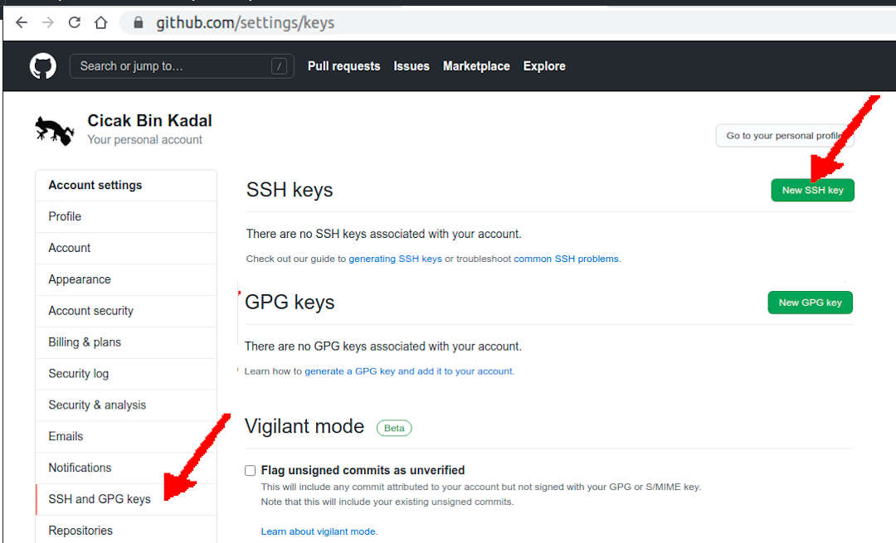
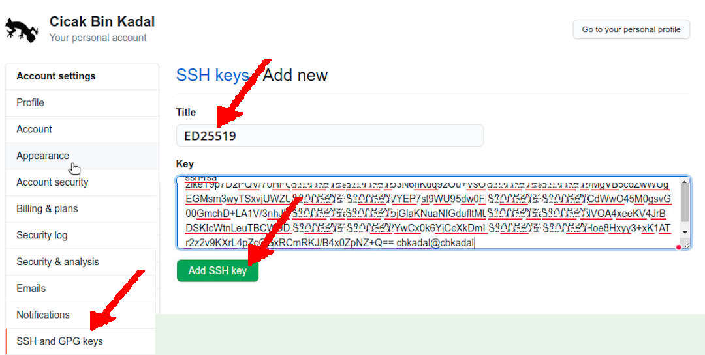
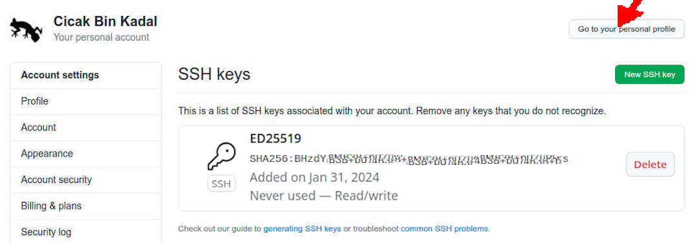

[&#x213C;](#idxXXX)<br id="idx000">

* Visit [GitHub.com/cbkadal/](https://GitHub.com/cbkadal/)
* Sign In 

<br>

<br>

* E.g. cbkadal

<br>

<br>

* Click the logo at the top right corner

<br>

<br>

* Signed as cbkadal
  * Select SETTINGS

<br>

<br>

* Select SSH and GPG keys (left bar)
  * Select New SSH Key

<br>

<br>

[&#x213C;](#)<br id="idx001">

## Copy your ED25519 public key


```
ls -al .ssh/id_ed25519* ; cat .ssh/id_ed25519.pub

```

(RESULT)
<br>

<br>

* Title: (e.g.) cbkadal
* Key: Paste your key
* Select: ADD SSH KEY

<br>

<br>

* Your key is at GitHub.com

<br>

<br>

* Return/Go to your personal profile

<br>
## Test Your Key

```
ssh -T git@github.com

```

(RESULT)
<br>

<br>

[&#x213C;](#)<br id="idxXXX">


