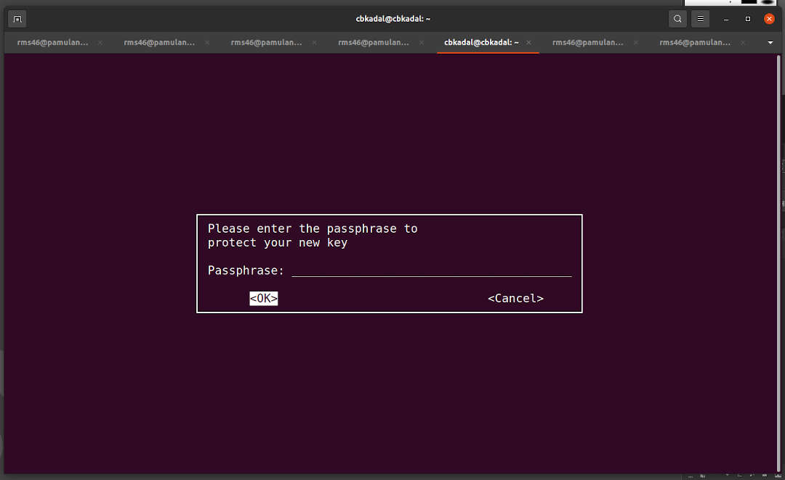
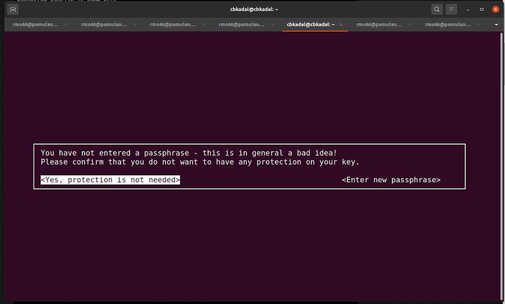

[&#x213C;](#idxXXX)<br id="idx000">

These following examples is for user **cbkadal** at **osp** (Guest).
Replace **cbkadal** with your own user name.

* RSA and RSA.
* Keysize is 4096 bits.
* key expires in 1 year.
* No passphrase
  * PUTTY: can not with no passphrase

```
gpg --full-generate-key

```

```
cbkadal@cbkadal:~$ gpg --full-generate-key

gpg (GnuPG) 2.2.40; Copyright (C) 2022 g10 Code GmbH
This is free software: you are free to change and redistribute it.
There is NO WARRANTY, to the extent permitted by law.

gpg: directory '/home/cbkadal/.gnupg' created
gpg: keybox '/home/cbkadal/.gnupg/pubring.kbx' created

Please select what kind of key you want:
   (1) RSA and RSA (default)
   (2) DSA and Elgamal
   (3) DSA (sign only)
   (4) RSA (sign only)
  (14) Existing key from card
Your selection? 1

RSA keys may be between 1024 and 4096 bits long.
What keysize do you want? (3072) 4096

Requested keysize is 4096 bits
Please specify how long the key should be valid.
         0 = key does not expire
      <n>  = key expires in n days
      <n>w = key expires in n weeks
      <n>m = key expires in n months
      <n>y = key expires in n years
Key is valid for? (0) 
Key does not expire at all
Is this correct? (y/N) y

GnuPG needs to construct a user ID to identify your key.

Real name: Cicak BinKadal
Email address: cbkadal@localhost
Comment: CBK
You selected this USER-ID:
    "Cicak BinKadal (CBK) <cbkadal@localhost>"

Change (N)ame, (C)omment, (E)mail or (O)kay/(Q)uit? O

```

* No passphrase (**You decide!**).



* Confirm: No Passphrase



```
We need to generate a lot of random bytes. It is a good idea to perform
some other action (type on the keyboard, move the mouse, utilize the
disks) during the prime generation; this gives the random number
generator a better chance to gain enough entropy.

gpg: /home/cbkadal/.gnupg/trustdb.gpg: trustdb created
gpg: directory '/home/cbkadal/.gnupg/openpgp-revocs.d' created
gpg: revocation certificate stored as 
'/home/cbkadal/.gnupg/openpgp-revocs.d/09DF7AB3750C81B9469B042466AEE6D3E959C516.rev'
public and secret key created and signed.

pub   rsa4096 2024-09-07 [SC]
      09DF7AB3750C81B9469B042466AEE6D3E959C516
uid                      Cicak BinKadal (CBK) <cbkadal@localhost>
sub   rsa4096 2024-09-07 [E]

cbkadal@cbkadal:~$

```

[&#x213C;](#)<br id="idxXXX">

